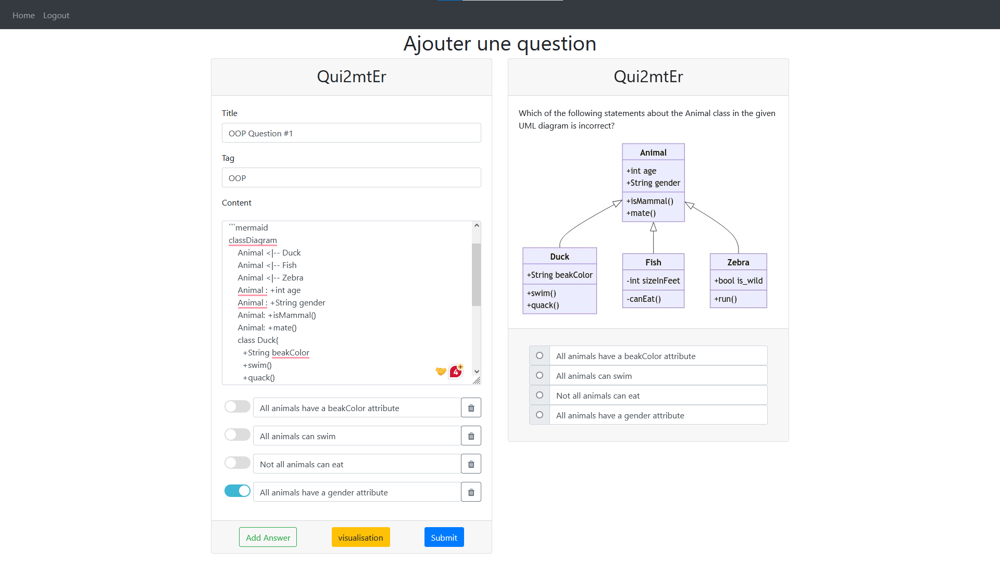
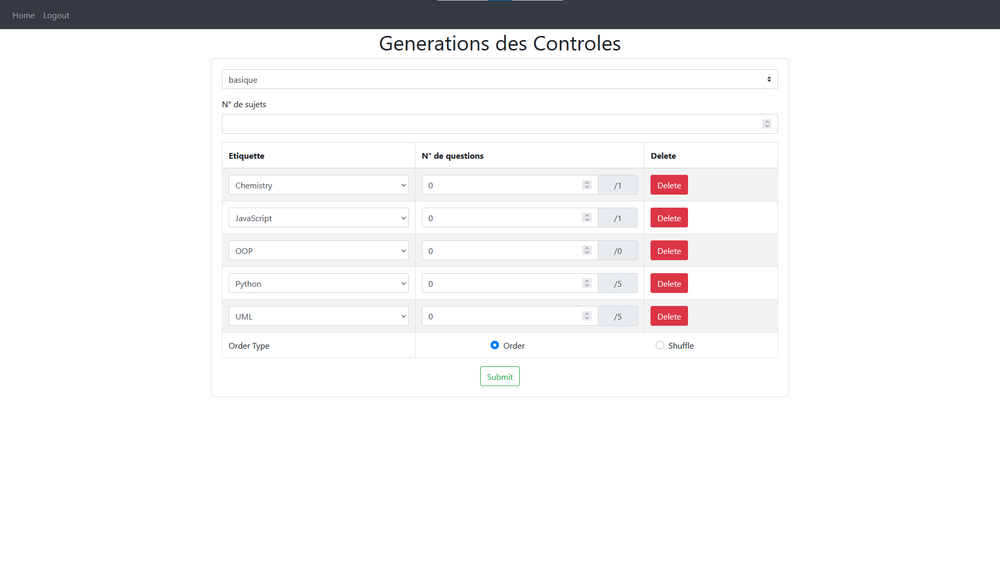

# Online Quiz App

## Overview

The Online Quiz App allows teachers to manage quizzes and exams, while students can take quizzes based on provided IDs. Teachers can add, update, or delete questions, exams, and sequences of questions. Questions support Markdown for text formatting and Mermaid for graphs.

## Features

- **Teachers**:
  - **Add Question**: Create and manage quiz questions supporting mermaid and markdown typing.
  
  - **Add Exam**: Generating Basic or Advanced Exams and you can drag and drop tags to make them in order or choose shuffle to randomize them, Check PDFs in README to see example of Exams.
  
  - **Add Sequence of Questions**: Create sequences of questions for exams.
  - **CRUD Operations**: Perform create, read, update, and delete operations on questions, exams, and sequences.

- **Students**:
  - **Login**: Access the quiz app using the provided email and password.
  - **Start Quiz**: Enter question or sequence ID to start answering.

- **Student Management**:
  - **CSV Import**: Insert student data via CSV files.

## Getting Started

To run the application, follow these simple steps:

1. **Install Dependencies**:
  ```bash
  pip install -r requirements.txt
  ```
  
2. **Run the Application:**:
  ```bash
  flask run
  ```